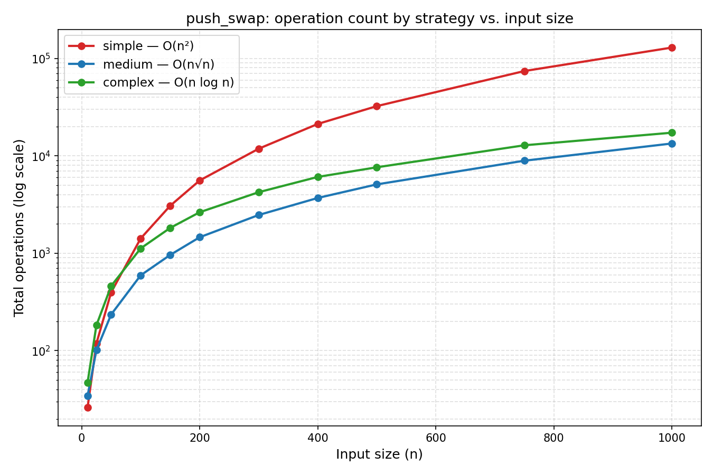
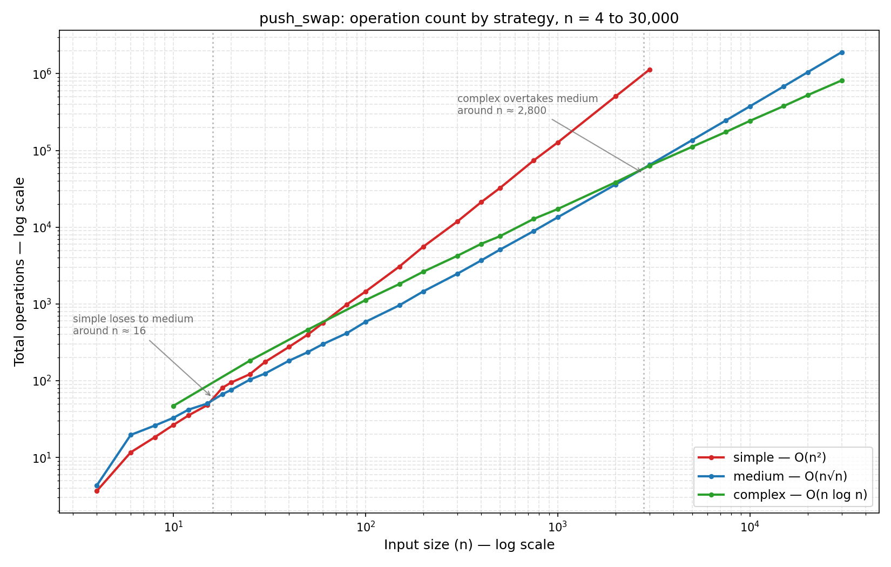

*This project was built as part of the 42 curriculum by vicdos-s and kasoares.*

# push_swap

[](https://github.com/42School/norminette)
[](https://en.wikipedia.org/wiki/C_(programming_language))

## Description

`push_swap` is a C program that receives a list of integers and prints the smallest valid sequence of operations needed to sort stack `a` in ascending order, using two stacks (`a` and `b`) and the eleven operations defined by the subject.

The program validates input, rejects duplicates and out-of-range integers, computes the disorder of the initial stack, and selects a sorting strategy either automatically (based on measured disorder) or explicitly via flag.

Supported selectors:

- `--simple`
- `--medium`
- `--complex`
- `--adaptive`
- `--bench`

## Project Structure

    .
    ├── include/
    │   └── push_swap.h
    ├── src/
    │   ├── main/           # entry point, config init, shared utils
    │   ├── parsing/        # argument parsing, flag detection, validation
    │   ├── operations/     # the eleven stack operations (sa, rb, pa, ...)
    │   ├── algorithms/      # simple / medium / complex sorting strategies
    │   └── bench/           # benchmark output
    ├── ft_printf/           # bundled dependency (libft + ft_printf)
    └── Makefile

## Contributions

Both authors reviewed, tested, and understand every algorithm and module in this repository, as required for the defense. Work was divided by area of primary ownership rather than by strict file boundaries: one author led parsing, flag handling, main dispatch, and the medium-complexity algorithm; the other led the operations layer, the simple sort baseline, and the complex (quicksort-variant) algorithm. Every non-trivial change went through a pull request on GitHub before merging into `dev`.

## Instructions

Build the project with:

```sh
make
```

This produces the `push_swap` executable in the repository root.

Clean build artifacts with:

```sh
make clean
make fclean
```

Run the program with a stack of integers:

```sh
./push_swap 3 2 1
./push_swap --adaptive 4 67 3 87 23
```

Optional benchmark mode:

```sh
./push_swap --medium --bench 3 2 1 5 4
```

If no parameters are provided, the program prints nothing and returns immediately.

## Project Rules Covered Here

- Written in C, compiled with `-Wall -Wextra -Werror`.
- Provides `all`, `clean`, `fclean`, and `re` Makefile rules.
- Builds the bundled libft and ft_printf dependencies through their own Makefiles.
- Contains no global variables.
- Frees heap allocations on both error paths and normal exit paths.

## Input and Output Rules

- Input must be a list of valid integers.
- Duplicate values are rejected.
- Invalid characters or malformed flags produce `Error\n` on stderr.
- Worth noting on integer parsing: our first version validated range *after* parsing the digits into a `long`, not during — which meant a pathological input long enough to overflow `long` itself would hit undefined behavior before the range check ever ran. It passed every test we threw at it during the defense, purely because unoptimized builds tend to wrap around predictably. That's not the same as being correct. We added the bound check inside the parsing loop itself after noticing this.
- The operation stream is printed on stdout.
- Benchmark data is printed on stderr only when `--bench` is present.

## Strategies

### `--simple`

This mode uses `selection_sort`.

It repeatedly finds the smallest value in stack `a`, rotates the stack with `ra` or `rra` depending on which side is cheaper, pushes that smallest value to stack `b`, and repeats until only three elements remain. The remaining three elements are ordered with a dedicated `order_three` routine, then the values are pushed back from `b` to `a`.

Why this is a valid `O(n^2)` strategy in the Push_swap model:

- each extraction scans the current stack to find the minimum
- each round can traverse most of the remaining stack
- the process repeats for many elements
- the total number of operations grows quadratically in the worst case

### `--medium`

This mode uses `medium_sort`, implemented as a K-sort style strategy.

The algorithm first ranks every value, then performs two phases:

- Phase 1 pushes values from `a` to `b` using a sliding window of roughly $1.4\sqrt{n}$ ranks.
- Phase 2 pulls values back from `b` to `a` by always bringing the current maximum in `b` to the top with the fewest rotations.

Why this is a reasonable `O(n\sqrt{n})`-style strategy in practice:

- the window size limits how many values are skipped before a push happens
- the structure reduces the number of full-stack traversals compared with `simple`
- stack `b` is organized so the largest values are recovered efficiently
- the operation count is much lower on large, mixed inputs

### `--complex`

This mode uses `quick_sort`, a rank-based quicksort variant adapted to the two-stack model.

The algorithm first calls `normalize_ranks`, which assigns every value in `a` its rank (0 to n-1). All subsequent decisions operate on ranks instead of raw integers.

`order_chunk(state, low, high)` recurses on rank ranges:

- The pivot is the deterministic midpoint `(low + high) / 2` of the current rank range, not a value drawn from the data. Because ranks form a permutation of `0..n-1`, this midpoint always splits the range into two equal halves regardless of input order.
- `partition_chunk` walks the top of `a`: values with rank `<= pivot` are pushed to `b`; values with rank `> pivot` are rotated toward the bottom of `a` and counted as "stays."
- The algorithm recurses on the high half first (still in `a`), pulls the low half back from `b`, then recurses on the low half.

Why this is an `O(n log n)`-class strategy in the Push_swap operation model:

- the deterministic midpoint pivot guarantees an exact split at every level, so recursion depth is `ceil(log2(n))` regardless of input — there is no data-dependent worst case
- each level partitions every element it touches with a bounded number of operations
- summed over `O(log n)` levels, total operation count is `O(n log n)`

The part worth understanding here isn't the pivot choice — a midpoint of a rank range is not a clever idea, it's just arithmetic. The interesting part is that `restore_stays` works even when there's already-sorted data sitting below the current chunk in `a`, left over from a previous partition. Rotating the whole physical stack instead of just "the chunk" sounds like it should scramble that leftover data. It doesn't: the number of reverse-rotations needed to bring the chunk back to the top is always exactly the count of elements that stayed, no matter what's underneath. We didn't design for that property on purpose — we noticed it held after tracing through a case by hand where it looked like it shouldn't.

We picked this over a merge-style approach for one practical reason: merging usually wants a third buffer to interleave two sorted runs, and two stacks is all this model gives you. Partitioning onto `b` and pulling back avoids needing one.

### `--adaptive`

This mode chooses a strategy automatically from measured disorder:

- disorder below `0.2`: `selection_sort`
- disorder from `0.2` to below `0.5`: `medium_sort`
- disorder at or above `0.5`: `quick_sort`

> **Note on the 0.5 boundary:** a uniformly random permutation has an *expected* disorder of exactly 0.5, since every pair is inverted with probability 1/2. A random benchmark input will land on either side of the `medium`/`complex` threshold roughly at random. This was previously stablished by the project subject and requirements, not our implementation choice.

## Benchmark

When `--bench` is enabled, the program prints metrics to stderr after sorting:

```text
[bench] disorder: XX.XX%
[bench] strategy: ...
[bench] total_ops: N
[bench] sa: ... sb: ... ss: ... pa: ... pb: ...
[bench] ra: ... rb: ... rr: ... rra: ... rrb: ... rrr: ...
```

### Measured performance against the subject's targets

Worst observed operation count across 10 runs (n=100) or 5 runs (n=500) of uniformly random input.

| n | strategy | worst ops | target for "pass" | target for "excellent" |
| --- | --- | ---: | ---: | ---: |
| 100 | `--adaptive` (default) | 1121 | < 2000 | < 700 |
| 100 | `--medium` | 606 | < 2000 | < 700 |
| 100 | `--complex` | 1123 | < 2000 | < 700 |
| 500 | `--adaptive` (default) | 7641 | < 12000 | < 5500 |
| 500 | `--medium` | 5168 | < 12000 | < 5500 |
| 500 | `--complex` | 7635 | < 12000 | < 5500 |
| 500 | `--simple` | 33440 | *n/a* | *n/a — O(n²) is required by the subject, not optimized for this size* |

Reproduce with:

```sh
ARG=$(shuf -i 0-9999 -n 500 | tr '\n' ' ')
./push_swap $ARG --bench
```



`medium` outperforms `complex` across the entire range tested, not just at the two sizes in the table above — worth remembering that Big-O comparisons describe growth rate, not which one wins at the sizes you actually care about.

### Beyond the subject's tested range

The subject only requires performance at n=100 and n=500 — `medium` wins in that window. Extending the test range reveals two crossovers `medium` and `complex` don't show up in the graded range:



- `simple` briefly beats `medium` for very small stacks (n < ~16) — below that size the O(n√n) window overhead in `medium` costs more than a plain O(n²) scan of a tiny stack.
- `complex` overtakes `medium` around n ≈ 2,800, and the gap widens continuously afterward — `O(n log n)` growing slower than `O(n√n)`, measured rather than assumed.

One honest caveat: both `medium` and `complex` rank every value by comparing it against every other value before sorting begins (`normalize_ranks`), which is `O(n²)` on its own. It doesn't show up in the operation counts above because ranking uses no stack operations — but it means wall-clock time at very large n (hundreds of thousands) is dominated by that step, not by the O(n log n) partition logic. We identified this while pushing the benchmark further and chose not to touch it: it's outside the operations the subject grades, and rewriting it risked destabilizing the quicksort logic we'd already defended.

## AI Usage

Claude reviewed the codebase during development and, after the defense, helped with a handful of small, isolated fixes — an integer-overflow guard in the parser, a couple of readability changes — that we read and tested ourselves before keeping. It also helped structure this README. We didn't hand off any algorithm design or debugging to it; the two of us wrote and defended every sorting strategy in this repo, in front of three evaluators, which is the part that actually matters.

Gemini helped read Valgrind output a couple of times when the stack traces got dense, and checked our English on this README.

## Resources

- The official 42 Push_swap subject and evaluation guide.
- The C `read`, `write`, `malloc`, and `free` man pages.
- Libft and ft_printf, bundled in this repository.

## Links

[](https://github.com/ksoares3991/push-swap)
